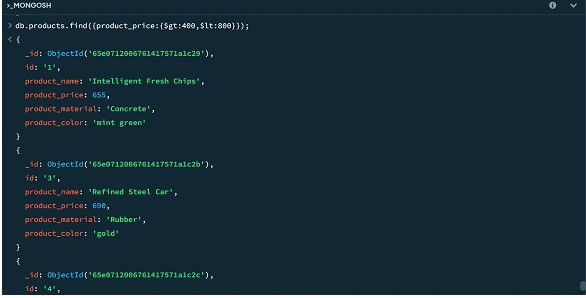
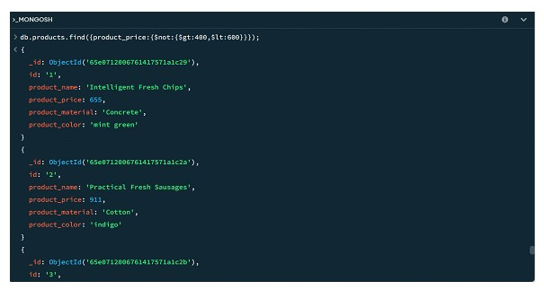
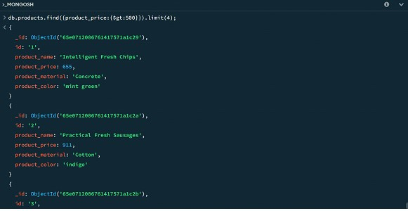
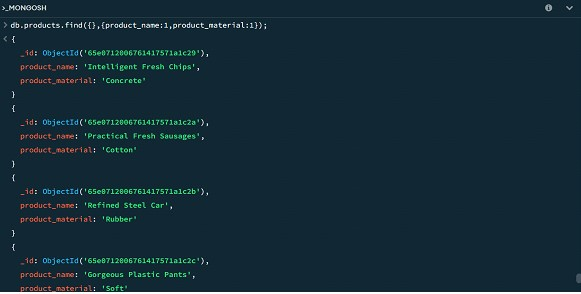
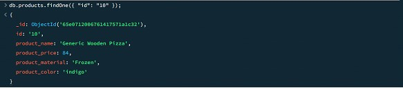
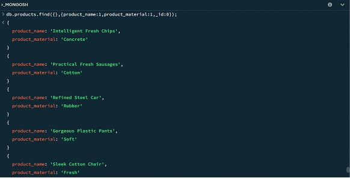

# MONGODB TASK 

* For the following question write the corresponding MongoDB queries

* Find all the information about each products
* Find the product price which are between 400 to 800
* Find the product price which are not between 400 to 600
* List the four product which are greater than 500 in price 
* Find the product name and product material of each products
* Find the product with a row id of 10
* Find only the product name and product material
* Find all products which contain the value of soft in product material 
* Find products which contain product color indigo  and product price 492.00
* Delete the products which product price value are 28

SOLUTION:

Question1: Find all the information about each products.

Solution: db.products.find();

 

 

Question2: Find the product price which are between 400 to 800

Solution: db.products.find({product_price:{$gt:400,$lt:800}});

 

Question 3: Find the product price which are not between 400 to 600.
Solution: db.products.find({product_price:{$not:{$gt:400,$lt:600}}});

 

Question 4: List the four product which are greater than 500 in price.
Solution: db.products.find({product_price:{$gt:500}}).limit(4);

 

Question 5: Find the product name and product material of each products.

Solution: db.products.find({},{product_name:1,product_material:1});

 

 Question 6: Find the product with a row id of 10.

Solution: db.products.findOne({“id”:”10”});

 

Question 7: Find only the product name and product material

Solution: db.products.find({},{product_name:1,product_material:1,_id:0});

 

* Question 8: Find all products which contain the value of soft in product material

Solution:  db.products.find({ "product_material": /soft/i });

* Question 9: Find products which contain product color indigo  and product price 492.00

 Solution:  db.products({ "product_color": "indigo", "product_price": 492.00 })

* Question 10: Delete the products which product price value are same

 Solution:  db.products.aggregate([{$group:{_id:'$product_price',count:{$sum:1}}}, {$match: {count : {$gt: 1}}}]).forEach((e) => {db.products.deleteMany({product_price: e._id})});

